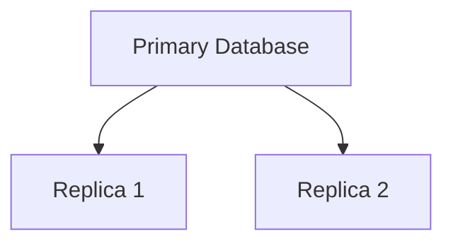
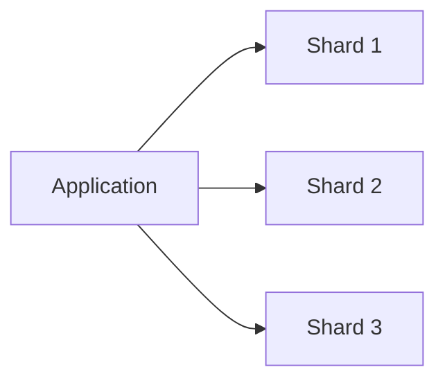

# Database Scaling, Replication, Partitioning and Sharding

## Horizontal Scaling vs Vertical Scaling

### Vertical Scaling

Vertical scaling means increasing the resources of a single machine.

Examples:
- Increase RAM from 16 GB to 64 GB
- Increase CPU cores
- Upgrade storage

```text
Before:
Database Server (16 GB RAM)

After:
Database Server (64 GB RAM)
```

### Advantages

- Easy to implement
- No major architecture changes

### Disadvantages

- Hardware limitations
- Expensive at scale
- Cannot scale indefinitely
- Single point of failure

---

### Horizontal Scaling

Horizontal scaling means adding multiple machines and distributing the load among them.

```text
DB Server 1
DB Server 2
DB Server 3
```

### Advantages

- Highly scalable
- Better fault tolerance
- Handles larger workloads

### Disadvantages

- Distributed system complexity
- Network communication overhead
- More operational effort

---

## Database Replication

Replication is the process of maintaining copies of a database on multiple servers.

### Purpose

- Faster read performance
- High availability
- Disaster recovery

### Architecture



### Primary Database

Used for:
- Write operations
- Updates
- Inserts
- Deletes

### Replica Database

Used for:
- Read operations
- Reporting
- Analytics

---

## Replication Lag

There may be a delay before updates made to the primary database are reflected in replicas.

### Example

1. User updates profile information.
2. Data is written to Primary DB.
3. User immediately requests profile data.
4. Request hits Replica DB.
5. Replica still contains old data.

Result:

```text
User sees stale data.
```

This delay is known as **Replication Lag**.

Once the replica receives updates from the primary database, the latest data becomes visible.

---

## Database Partitioning vs Sharding

Although often used interchangeably, they are different concepts.

---

## Database Partitioning

Partitioning divides data within a single database server.

It is mainly used to improve performance and manage large datasets.

### Example

Partition data by date:

```text
Orders_2024
Orders_2025
Orders_2026
```

Or partition using:

- Range
- Date
- Partition Key

### Characteristics

- Single database instance
- Improves query performance
- Easier management of large tables

### When to Use

When data can still fit within a single database server but tables become very large.

---

## Database Sharding

Sharding distributes data across multiple independent database servers.



Each shard stores a subset of the data.

### Characteristics

- Multiple database servers
- Horizontal scaling
- Increased storage capacity
- Increased throughput

### Advantages

- Highly scalable
- Distributes workload
- Reduces pressure on a single database

### Disadvantages

- More complex implementation
- Harder cross-shard queries
- More operational complexity

---

## Hotspot Problem (Celebrity Problem)

A hotspot occurs when one shard receives significantly more traffic than other shards.

### Example

```text
Shard 1 -> 80% traffic
Shard 2 -> 10% traffic
Shard 3 -> 10% traffic
```

The overloaded shard becomes a bottleneck while other shards remain underutilized.

---

## Why Does This Happen?

Usually because of a poor partition key.

Bad example:

```text
Partition Key = Country
```

If most users belong to a single country, one shard receives most of the traffic.

This creates:

- Uneven load distribution
- Performance bottlenecks
- Reduced scalability

---

## Solutions

### Better Partition Key

Choose a key that distributes data more evenly.

Examples:

```text
user_id
device_id
order_id
```

### Hash-Based Partitioning

Use hashing to distribute data uniformly.

```text
hash(user_id) % N
```

where N = number of shards.

### Salting

Add a random prefix or suffix to keys.

Example:

```text
A_user123
B_user123
C_user123
```

This helps spread traffic across multiple partitions.

---

## DynamoDB Partition Key

In DynamoDB, the partition key determines where data is physically stored.

A good partition key should:

- Distribute traffic evenly
- Avoid hotspots
- Scale efficiently

A bad partition key can result in:

- Hot partitions
- Throttling
- Uneven performance

---

## Database Indexing

Indexing is a technique used to retrieve data faster and optimize queries.

Without an index:

```text
Database scans entire table
```

With an index:

```text
Database directly locates matching records
```

### Benefits

- Faster lookups
- Faster filtering
- Improved query performance

### Common Data Structure

Most databases implement indexes using:

```text
B-Tree (Balanced Tree)
```

which supports efficient searching and range queries.

---

## Key Takeaways

- Vertical scaling increases resources on a single machine.
- Horizontal scaling adds more machines.
- Replication improves read performance and availability.
- Replication lag can cause stale reads.
- Partitioning divides data within a single database.
- Sharding distributes data across multiple databases.
- Poor partition keys lead to hotspot problems.
- DynamoDB partition keys directly impact scalability.
- Indexes improve query performance using structures such as B-Trees.

---

### Interview Talking Points

- Explain replication lag using the user profile update example.
- Explain hotspot problems using a celebrity user scenario.
- Explain why partition key design is critical in DynamoDB.
- Discuss the trade-offs between vertical and horizontal scaling.